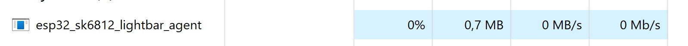
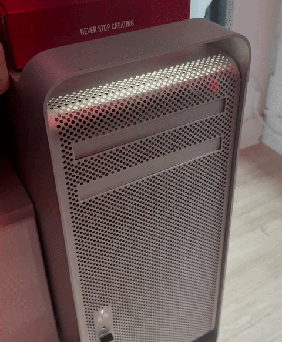
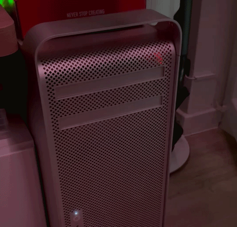
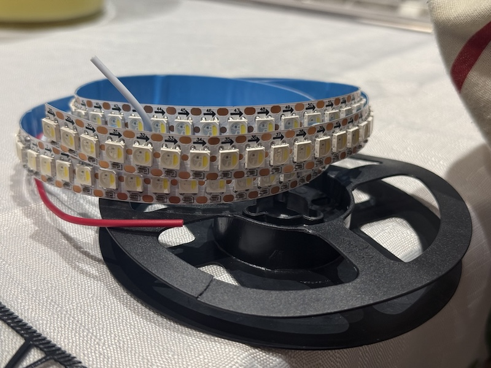
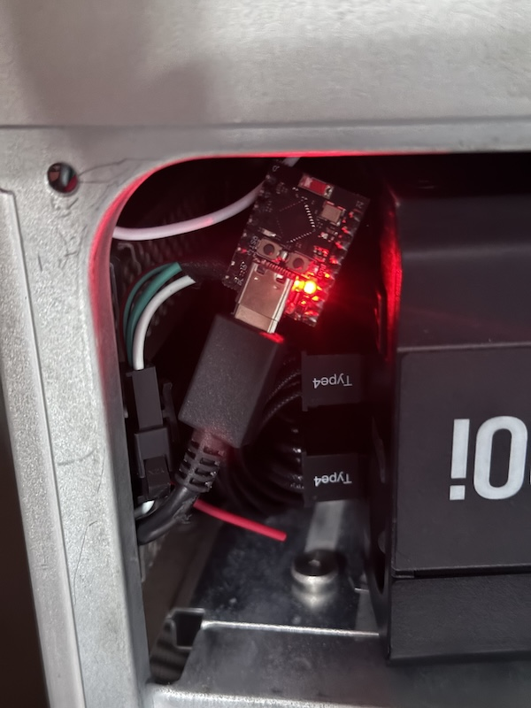
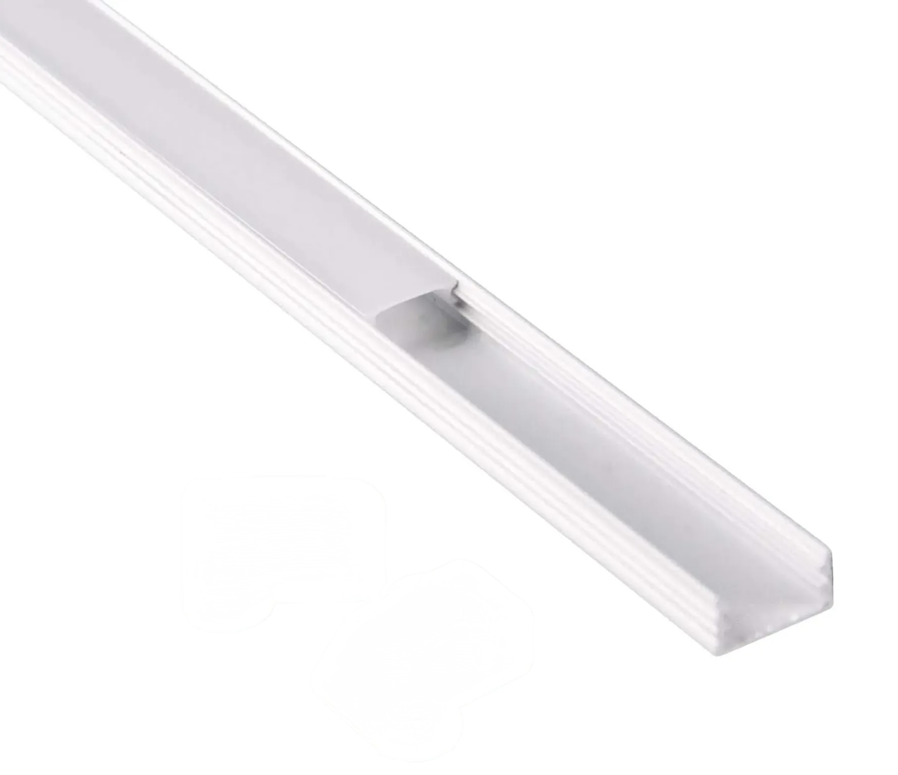

# An SK6812 LED bar for PC (controlled by an ESP32-C3)

This project contains the source code for an ESP32-C3 controller and a Windows background agent/controller (that sends "sleep"/"resume"/"shut down" events to the ESP32).

The project assumes you have ports USB powered even if the PC is turned off (thus, the ESP32 firmware expects it will be powered 24/7). But it should work even if the PC cuts power to the ESP32 when turned off.

## Features

- Nice white glow
- Smooth animation/transition
- Turns on with your Windows PC, turns off when you turn off your PC
- Works with USB power when shut down (and without it)
- Sleep “breathing” animation (requires USB power when suspended)
- Animation with dithering and FPS lock for smooth and stable operation
- Windows app/agent is very lightweight (needs 0.7MB-0.9MB of RAM and Task Manager shows 0% CPU activity for this agent all the time)
- The Windows app/agent autodetects the ESP32 controller (no need to configure anything, just run the app)

## How to use?

You need an ESP32, SK6812 LED strip, soldering skills and Arduino IDE.

Optionally, you need Rust if you want to build the Windows agent (the exe is also available in [rekeases](https://github.com/multicatch/esp32_sk6812_pc_lightbar/releases)).

The LED agent needs to be added to *Startup* (as per instructions [here](./esp32_sk6812_lightbar_agent)).

## Subprojects

* [esp32 - Arduino IDE source code for ESP32-C3](./esp32)
* [esp32_sk6812_lightbar_agent - Rust code for a Windows app](./esp32_sk6812_lightbar_agent)

## Pictures of my implementation

#### Turning off the computer

#### Sleep mode animation

#### LED Strip (5V SK6812 with cold white)

Each "pixel" of this LED Strip is individually addressable. I used a 5V variant with 144 LEDs/1m. I’ve cut a ~19cm section (27 LEDs). Unfortunately it was still not smooth enough for a seamless "breathing" animation, but I implemented temporal dithering and now it looks nice and premium.

#### ESP32 installed inside (connected to internal USB header)

I’ve wrapped it in elective tape after taking this picture, I don’t want the pins touching the aluminum case.

#### LED Light Profile

Not my photo, it’s a picture found on the internet. I bought mine in Obi and cut 19cm to fit it inside my PC case (the Mac Pro case). It blends the LEDs really nicely

