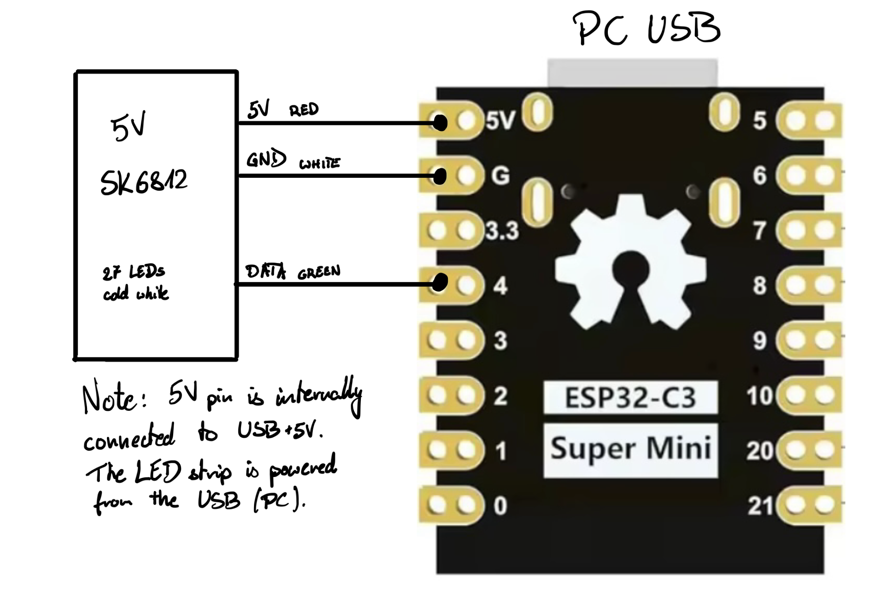

# ESP32 SK6812 driver

This folder contains source code for ESP32 firmware that will control and play animations on your LED strip (SK6812).

## Features

- pending connection animation
- sleep mode animation
- customizable animations (see the comments at the start of the source code)
- customizable color of sleep, wake, pending, off state
- turns off with your PC (even if you have USB power when the PC is turned off)

## Schematics

I’ve used an SK6812 LED strip with 144LEDs/m. I’ve cut a ~19cm section (27 LEDs). 

The 5V pin is actually connected to the USB+5V line, so I was able to avoid excessive connections. I connected the ESP32 to a 9-pin USB 2.0 internal header and it powers everything.

If you connect your LED strip to the 5V pin (like I did), then make sure that USB is the only source of power. Don’t connect anything to the 3.3V pin and don’t connect any power to the LEDs.

If USB is too weak to power the whole LED strip, then just disconnect the red (5V) and white (GND). You can probably reuse your [4-pin Molex ATX connector](https://en.wikipedia.org/wiki/Molex_connector) to power your LED strip (red = 5V, 2x black = GND, yellow = 12V). You can also choose this solution if you have a 12V LEDs (instead of the 5V variant). 

## How to build?

First, install Arduino IDE first, then open File > Preferences and paste this URL into “Additional Boards URL” (or something like this): `https://raw.githubusercontent.com/espressif/arduino-esp32/gh-pages/package_esp32_index.json`.

Now you can install esp32 by espressif in your Arduino IDE. I used ver. 3.3.11. 

To build this sketch, you also need to add [AxlRocket/ESP32_SK6812](https://github.com/AxlRocket/ESP32_SK6812) as dependency.

1. Download [repository](https://github.com/AxlRocket/ESP32_SK6812/) as .zip file (or use zip from this folder).
3. In Arduino IDE: Sketch -> Include Library -> Add .ZIP Library
4. Include the library in your project using "#include <SK6812.h>" directive

Select `ESP32-C3 DevKit` as your board and **enable USB CDC on Boot**. This option is required for the [Rust agent](../esp32_sk6812_lightbar_agent) to work.

If you have chosen other pin than GPIO 4, then change LED_PIN to an appropriate number.

Similarly, if you have more/less LEDs than 27, change the LED_COUNT. I recommend an odd number of LEDs, because then there is 1 “central” LED (which makes the glow effect look even).

